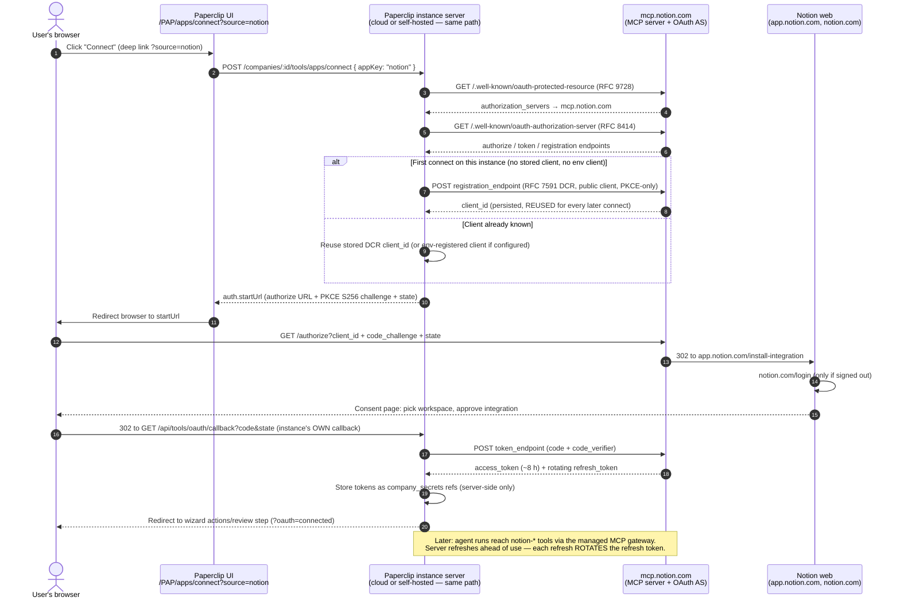

# Connector Playbook: Add A Vendor As A Catalog Entry

This playbook is the repeatable template for adding a vendor to the Apps catalog as data, not as a plugin. It follows the accepted connections framework in [PAP-13211](/PAP/issues/PAP-13211), the first-30 rollout matrix in [PAP-2432](/PAP/issues/PAP-2432), and the production validation scope in [PAP-12373](/PAP/issues/PAP-12373).

Use it when Paperclip acts on an external system through a governed connection: a stored credential, a capability catalog, access profiles and policy rules, and audit. Inbound integrations, such as an external client acting on Paperclip, use gateway or webhook guidance instead.

Every connector built with this playbook is a **plane P2** connection — a resource token in the instance vault, acquired via the connect broker, never a sign-in authenticator. Before writing a connector, read [Identity vs. connections](./README.md#identity-vs-connections) for the P1/P2/P3 boundary and the D7 standing rule (sign-in tokens are never reused as resource tokens; id.paperclip.ing never stores resource tokens; no connections hub on the ID service).

## Output

A complete connector proposal produces:

- A catalog manifest entry with user-facing app metadata.
- Transport and auth configuration.
- Credential secret refs into `company_secrets`; never raw env values.
- Action catalog metadata with risk classes, schemas, resource filters, and quarantine defaults.
- Default profile and policy behavior for read, write, and destructive actions.
- A smoke checklist aligned to [PAP-12373](/PAP/issues/PAP-12373): connect, discover catalog, allowed read call, ask-first write call, denied/quarantined call, revoke, and audit evidence.

## Step 1: Confirm It Is A Catalog Entry

Default to a catalog entry when the vendor can be represented as metadata plus a transport:

- The connection points at a remote MCP endpoint, an approved local stdio template, or a generated shim over a documented API.
- The setup flow only needs normal fields, OAuth redirect handling, resource filters, policy defaults, and health/catalog checks.
- The vendor does not need its own database tables, background workers, custom issue-thread interactions, or dedicated UI pages.

Use a plugin only when the integration needs code that cannot fit inside the common connection model:

- Product surface: custom pages, dashboards, panes, or rich configuration UI beyond schema-driven forms.
- Data model: plugin-owned tables, migrations, or long-lived local state.
- Execution: workers, schedulers, webhooks, sync loops, file processors, or vendor-specific runtimes that are not a simple transport shim.
- Packaging: a third party wants to ship the integration as an extension package.

A plugin may bundle one or more catalog entries, but it must still create normal applications, connections, credential refs, catalog entries, profiles, policies, and audit events. Plugin code must not bypass the gateway, policy engine, `company_secrets`, changed-action quarantine, or call-event audit log.

## Step 2: Classify The Reuse Path

Classify the vendor before writing metadata. Use the [PAP-2432](/PAP/issues/PAP-2432) matrix terms so rollout planning, security review, and QA can compare providers consistently.

| Reuse path | Use when | Typical transport | Examples from the matrix |
| --- | --- | --- | --- |
| MCP-direct | The vendor exposes an official or stable MCP server whose tools map cleanly to Paperclip grants. | `mcp_remote`; `local_stdio` only for approved trusted templates. | Linear, Notion, Sentry, Vercel, Exa, Apify, Context7. |
| OpenAPI-shim | The vendor has a documented REST/OpenAPI surface but no stable MCP server, and a generated/thin shim can expose safe actions. | Shim service or approved template that presents an MCP-compatible catalog to Paperclip. | Datadog, Apollo, QuickBooks, Ramp/Brex, Zendesk. |
| Vendor-deep-wrapper | The vendor boundary depends on app-installation tokens, event validation, rich domain semantics, resource grants, or high-risk writes. | Vendor-specific wrapper behind the same connection model. | GitHub, Slack, Google Workspace writes, Atlassian, Microsoft 365, Cloudflare, Figma, Stripe, Salesforce, HubSpot, Intercom, PagerDuty. |

Record the classification in the proposal along with the transport and the reason a lighter path is or is not enough.

## Step 3: Pick Auth And Credential Ownership

Choose one auth mode:

- OAuth: user or workspace authorization through Paperclip-owned OAuth app registration. Use for vendors with delegated scopes and revocation APIs.
- API key: operator-supplied token or key. Use only when scopes can be constrained and the key is stored as a `company_secrets` ref.
- App-installation: bot/app token, GitHub App installation, Slack bot token, or similar installation credential.
- None: public/read-only systems or first-party fixtures that do not require vendor credentials.

Credentials always live in `company_secrets` with redacted metadata and versioned material. The catalog entry records the secret binding shape, not the secret value:

```json
{
  "credentialSecretRefs": [
    {
      "configPath": "credentials.authorization",
      "label": "Linear OAuth access token",
      "required": true
    }
  ],
  "credentialRefs": [
    {
      "name": "Authorization",
      "placement": "header",
      "key": "Authorization",
      "prefix": "Bearer ",
      "secretId": "<resolved at connect time>"
    }
  ]
}
```

Do not add durable vendor credentials to agent env, project env, runtime env, adapter config, issue comments, screenshots, logs, fixture JSON, or plugin config. Agents receive a run-scoped gateway token; Paperclip resolves the vendor credential server-side and audits the call.

## Step 4: Author The AppDefinition

Author an `AppDefinition` as the canonical data record for the app and every supported connection method. It must explain what the operator gets without exposing protocol details in prosumer surfaces. Developer docs can mention transport, MCP, shim, and gateway terms; the Apps gallery copy should use plain app/action language.

Capture:

- `key`: stable lowercase app key, e.g. `linear`.
- `name`, `logoUrl`, `tagline`, `description`: user-facing metadata.
- `methods`: explicit combinations of `transport` (`mcp_remote`, `rest_api`, `local_stdio`), `authKind` (`oauth`, `api_key`, `none`), and `ownership` (`platform_shared`, `platform_provisioned`, `customer`, `dcr`).
- Stable connection UID namespace used to form `{namespace}/{slug}` addresses.
- `credentialFields`: labels, vendor-call placement, header key, prefix, help URL, and required state. User-facing labels should be sanitized by the Apps UI copy layer. The saved value is always a `company_secrets` ref, not an env entry.
- `oauth`: provider key, scopes, authorization URL, token URL, metadata URL if applicable.
- `urlPatterns`: URLs that can identify this app during paste/import flows.
- `recommendedDefaults`: access and risk defaults, especially ask-first risk levels.
- `availability`: whether the connector is generally available, gated by deployment config, or needs vendor registration.

Keep `AppDefinition` metadata deterministic and company-scoped at install time. Global catalog data names capabilities; company connection and grant rows hold the configured instance, subject/provider tenant, secret refs, resource filters, status, health, and audit history.

## Step 5: Model Resource Filters

Every connector proposal needs resource filters before write actions are enabled. Filters are part of the connection configuration and must be enforced by the gateway or wrapper, not only by UI affordances.

Common filter dimensions:

- Account boundary: workspace, org, team, tenant, site, portal, realm, account.
- Resource boundary: repo, channel, page, database, project, zone, file, folder, dashboard, issue queue.
- Object boundary: issue status, labels, branch, environment, object type, record type, field list, attendee domain.
- Egress boundary: domain allow/deny list, result limits, content category, attachment/file-type limits.
- Mutation boundary: create-only, draft-only, comment-only, no delete, no external send, dry-run required.

The connection health and catalog discovery steps should fail or warn when required filters are absent for S3/S4 providers.

## Step 6: Define The Action Catalog

List each initial action before implementation. Do not rely on vendor tool names alone; Paperclip needs normalized metadata for review, policy, and audit.

For each action, capture:

- Stable tool name and user-facing title.
- Description in operator language.
- Input and output schema.
- Read/write/destructive flags and risk level.
- Resource filter fields used by the action.
- Redaction plan for arguments and results.
- Expected audit fields.
- Whether the action is enabled, disabled, or quarantined by default.
- Negative access case: ungranted actor, disallowed resource, revoked connection, or cross-company attempt.

Risk classes:

| Risk | Examples | Default |
| --- | --- | --- |
| `read` | Search, list, fetch metadata/content inside allowed resources. | Active when profile includes the app or read risk level. |
| `write` | Create issue, add comment, update status, append block, trigger redeploy. | Ask-first unless the default profile or a reviewed policy narrows it further. New/changed write tools start quarantined when discovered after initial review. |
| `destructive` | Delete, refund, cancel production deployment, send external message, broad tenant mutation. | Quarantined. Requires explicit operator review and usually a `require_approval` policy even after review. |

Changed-action quarantine is mandatory: if catalog refresh finds a new or schema-changed write/destructive action, the entry stays hidden from agents until an operator reviews and re-enables it. Do not mark a changed action active just because a previous action with a similar name was active.

## Step 7: Select The Wizard Path

The wizard path comes from auth mode and transport:

| Auth mode | Operator path | Stored result |
| --- | --- | --- |
| OAuth | Gallery card -> Connect -> vendor consent -> callback -> configure filters -> health/catalog -> access defaults. | OAuth token material in `company_secrets`; connection metadata redacted. |
| API key | Gallery card -> paste key -> configure filters -> health/catalog -> access defaults. | Key material in `company_secrets`; no raw key returned after save. |
| App-installation | Gallery card -> install app/bot -> callback or paste installation identifier -> configure filters -> health/catalog -> access defaults. | Installation credential in `company_secrets`; installation account metadata redacted. |
| None | Gallery card -> configure allowed resources -> health/catalog -> access defaults. | No vendor secret; connection row still carries config and audit scope. |

The operator should see Apps, Connections, and Review language. Keep protocol language behind Developer/Advanced copy.

## Step 8: Apply Governance Defaults

Governance is automatic because every catalog entry becomes a normal tool-access object:

1. Catalog status gates first: `disabled` and `quarantined` deny immediately.
2. Profiles decide which actors can see catalog entries. Bindings can target company, project, agent, routine, or issue scopes.
3. Policies decide whether a visible action is allowed, blocked, rate-limited, or requires approval.
4. Ask-first calls create action requests with signed arguments. Approval applies only to the reviewed argument shape and unchanged schema hashes.
5. Every decision and call writes audit with actor, run, issue, connection, catalog entry, decision, reason code, redaction summary, outcome, and latency.

Recommended defaults for a new catalog entry:

- Create a read-friendly default profile only when read actions are low or medium risk and resource filters are present.
- Set `recommendedDefaults.askFirstRiskLevels` to `["write", "destructive"]` unless the connector is read-only.
- Add an explicit block or quarantine for destructive actions until SecurityEngineer review.
- Add rate-limit policy for search/fetch APIs, vendor quota-sensitive APIs, and paid APIs.
- Require approval for any external send, deploy, refund, delete, tenant-wide mutation, or action that can expose private customer data outside Paperclip.

## Step 9: Align With Production Validation

[PAP-12373](/PAP/issues/PAP-12373) owns real-vendor gallery smoke evidence and connector validation. Do not duplicate that issue's screenshot/evidence matrix in this playbook. A connector proposal should instead state exactly how it will be validated there:

- Connect succeeds against the real vendor using production-like OAuth/app/key setup.
- Catalog discovery produces the expected actions and quarantines new/changed risky actions.
- An allowed read call succeeds through the gateway.
- A write call opens ask-first review and succeeds only after approval.
- A blocked/quarantined action cannot be listed or invoked by an agent.
- Revocation removes tools and blocks execution immediately.
- Activity/audit rows prove actor, run/issue context, resource id, decision, reason code, and outcome.

If a gallery card cannot pass this path against a real vendor, de-list it or mark it unavailable until the missing auth, transport, or governance dependency is fixed.

## MCP-Direct Connections (Hosted MCP + OAuth)

Many vendors now expose an official hosted MCP server whose authorization
server is discovered from the MCP endpoint itself, instead of documenting fixed
OAuth URLs. For these connectors the manifest's `oauth` block is a hint at
most; the broker resolves endpoints at connect time:

1. `GET <serverUrl>` unauthenticated returns `401` with a `WWW-Authenticate`
   header naming the protected-resource metadata URL (RFC 9728).
2. `GET /.well-known/oauth-protected-resource[/<path>]` names the
   authorization server(s).
3. `GET /.well-known/oauth-authorization-server` (RFC 8414) yields
   `authorization_endpoint`, `token_endpoint`, and — when the vendor supports
   dynamic registration — `registration_endpoint`.

The broker implements this in `discoverOAuthEndpoints`
(`server/src/services/tool-access.ts`), but discovery is **not**
unconditional. `oauthEndpointsForConnection` resolves endpoints in this
order:

1. If the manifest's method `defaults` ship a **complete** pair
   (`authorizationEndpoint` **and** `tokenEndpoint`), those are used
   unconditionally. `discoverOAuthEndpoints` never runs in this case, so
   endpoints stored on the connection's own OAuth config and 401 challenge
   hints are **not consulted at all**.
2. Otherwise, for `mcp_remote` connections, the broker calls
   `discoverOAuthEndpoints`, which first checks endpoints already stored on
   the connection's own OAuth config (falling back field-by-field to the 401
   challenge hints); a complete stored/hinted pair is used as-is — no
   `.well-known` fetch.
3. Only when neither of the above yields a complete pair does the broker run
   the RFC 9728 → RFC 8414 discovery chain above.

Consequence: complete manifest endpoint hints are **authoritative, not
hints** — they override even endpoints that an earlier discovery persisted
on the connection, and if they go stale the broker keeps using them. For
discovery-capable vendors, ship only `serverUrl` in `defaults` (as
`notion.json` does) so the broker discovers fresh endpoints at connect
time; add explicit `authorizationEndpoint`/`tokenEndpoint` only for vendors
that do not publish RFC 9728/8414 metadata, and then own keeping them
current.

### Dynamic client registration (RFC 7591)

Vendors whose authorization server advertises a `registration_endpoint` and
supports public clients (`token_endpoint_auth_method: "none"` plus PKCE S256)
need **no pre-provisioned OAuth app at all**. At first connect the broker
registers a client on the fly and stores it on the connection:

- Registration request: `client_name` `Paperclip (<instance host>)`,
  `redirect_uris` = the instance's own callback, `grant_types`
  `["authorization_code", "refresh_token"]`, `response_types` `["code"]`,
  `token_endpoint_auth_method` `"none"`.
- The issued `client_id` is persisted in the connection's OAuth config and any
  issued `client_secret` becomes a `company_secrets` ref. The registered
  client is **reused** for every later authorize/refresh on that connection —
  re-registering orphans prior grants on providers that bind grants to the
  client.
- Env-registered clients always win: when
  `PAPERCLIP_TOOL_OAUTH_<PROVIDER>_CLIENT_ID/_SECRET` are configured, the
  broker uses them (`customer` ownership) and skips registration. List both
  `customer` and `dcr` in the method's `ownershipModes` when the vendor
  supports both.

**DCR needs neither Paperclip ID nor Paperclip Connect.** DCR is always
instance-local (ratified in the PAP-14828 connector-service spec, section 10
item 8.4: "DCR is always instance-local; the service has no DCR involvement").
Each instance registers its own public client with the vendor and uses its own
`/api/tools/oauth/callback` redirect. **Cloud-hosted and self-hosted instances
use the SAME path** — the only per-instance difference is the hostname inside
the redirect URI. `id.paperclip.ing` authenticates operators only and never
holds resource tokens; `connect.paperclip.ing` is a fallback only for
providers that genuinely require a pre-registered public redirect, which a DCR
provider by definition does not.

### Redirect-URI constraints

Vendors restrict what `redirect_uris` a dynamic client may register. Record
the probed constraint in the `AppDefinition` `redirectConstraints` field and
enforce it before starting OAuth. The first supported value is
`https-or-loopback-http` (Notion's rule): HTTPS on any host — public or
private — or plain HTTP only on loopback (`localhost`, `*.localhost`, `::1`,
`127.0.0.0/8`). A plain-HTTP non-loopback origin fails fast with
`oauth_redirect_origin_unsupported` ("This provider requires an HTTPS or
loopback origin. Configure TLS before connecting.") and a pointer to the TLS
deployment docs, instead of a confusing vendor-side `invalid_redirect_uri`.
Probe the constraint with real registration attempts before writing the
manifest — the redirect-URI rule and browser-reachability are independent
axes; a private HTTPS host can be fine even when plain HTTP is not.

### Documentation standards for every connection doc

Every connection doc — playbook appendix, proposal, or user-facing doc —
must include all three of the following (they are part of the template below):

1. **Service involvement statement.** Say explicitly whether Paperclip ID or
   Paperclip Connect participates in the flow. For RFC 7591 DCR providers the
   answer is always: neither — DCR is instance-local and cloud vs self-hosted
   use the same path.
2. **Sequence diagram + exact endpoints.** A sequence diagram of how the
   connection works, and the exact paths/endpoints used for auth: authorize,
   token, registration (if DCR), and the Paperclip callback. Keep mermaid
   sources next to the doc; do not put semicolons inside mermaid message text
   (they parse as statement separators).
3. **Administrator setup instructions.** Step-by-step: what (if anything) an
   admin must register — callback URLs? client credentials? nothing, for DCR? —
   where to register it, and how to verify the connection works end to end.

## Template

Copy this section into a connector proposal or implementation issue.

```md
## Vendor

- App key:
- App name:
- Owner:
- First-30 classification: MCP-direct / OpenAPI-shim / vendor-deep-wrapper
- Reason for classification:
- Security tier: S1 / S2 / S3 / S4
- Plugin needed? No / Yes, because:

## Transport And Auth

- Transport:
- Endpoint or approved template:
- Auth mode: OAuth / API key / app-installation / none
- OAuth scopes or key scope:
- Credential owner: company / user-delegated / app-installation
- Secret storage: company_secrets refs only
- Revocation behavior:

## Connection Flow (mandatory)

- Sequence diagram: <mermaid source or rendered image — REQUIRED for every connection doc>
- Auth endpoints (exact paths):
  - Authorize:
  - Token:
  - Registration (if DCR):
  - Discovery (.well-known), if any:
  - Paperclip callback: `/api/tools/oauth/callback` (or n/a)
- Redirect constraints (probed): none / https-or-loopback-http / requires-public-redirect
- Paperclip ID / Paperclip Connect involvement: <"none — DCR is instance-local; cloud and self-hosted use the same path" for RFC 7591 providers; otherwise name the role>

## Administrator Setup (mandatory)

- What the admin must register (callback URLs? client credentials? nothing for DCR?):
- Where to register it:
- Instance prerequisites (TLS, base URL, feature flags):
- How to verify the connection works:

## Resource Filters

- Required filters:
- Optional filters:
- Write-enabling filters:
- Filters enforced by:

## Manifest

- key:
- name:
- tagline:
- authKind:
- transportTemplate:
- credentialFields:
- oauth:
- urlPatterns:
- recommendedDefaults:
- availability:

## Actions

| Tool | Risk | Default status | Filters | Approval default | Audit fields | Negative case |
| --- | --- | --- | --- | --- | --- | --- |
| | read/write/destructive | active/quarantined/disabled | | allow/ask-first/block | | |

## Wizard Path

- User path:
- Configuration steps:
- Error states:
- Redacted metadata shown:

## Governance Defaults

- Default profile:
- Profile bindings:
- Policies:
- Quarantine rules:
- Rate limits:

## Validation Hook

- Real-vendor smoke issue:
- Connect evidence:
- Catalog evidence:
- Allowed read:
- Ask-first write:
- Denied/quarantined case:
- Revoke:
- Audit:
```

## Appendix: Linear Dry Run

This dry run applies the template to Linear, one of the [PAP-2432](/PAP/issues/PAP-2432) Batch A providers.

### Vendor

- App key: `linear`
- App name: Linear
- First-30 classification: MCP-direct with a thin GraphQL/resource-filter wrapper if the hosted MCP server cannot enforce all filters itself.
- Reason for classification: Linear has a hosted MCP endpoint shape in the current gallery, and the first-30 matrix calls Linear a direct MCP/GraphQL thin-wrapper provider.
- Security tier: S2, because it exposes product planning data and narrow issue mutations but not payments, tenant admin, or production infrastructure.
- Plugin needed: No. The default gallery card, OAuth connect, resource filters, action catalog, profiles, policies, and audit cover the required UX. A plugin would only be warranted later for custom Linear dashboards or background sync workers.

### Transport And Auth

- Transport: `mcp_remote`
- Endpoint: `https://mcp.linear.app/mcp`
- Auth mode: OAuth
- OAuth scopes: `read` and `write` initially, with writes governed by profiles and ask-first policies.
- Credential owner: company connection backed by user/workspace consent.
- Secret storage: OAuth token material stored as `company_secrets` refs; no token in agent env, project env, comments, logs, or screenshots.
- Revocation behavior: disabling or revoking the connection immediately removes Linear tools from agent sessions and denies brokered execution on the next gateway check.

### Resource Filters

- Required filters: workspace, team.
- Optional filters: project, label, cycle, issue status.
- Write-enabling filters: team plus project or label/cycle filter for create/update; comment-only writes may allow team-only with explicit policy.
- Enforced by: gateway policy selectors, wrapper-side argument validation, and vendor request construction. UI filter pickers are convenience only, not the enforcement boundary.

### Manifest Sketch

```json
{
  "key": "linear",
  "name": "Linear",
  "tagline": "Create, update and read tickets.",
  "authKind": "oauth",
  "transportTemplate": {
    "transport": "mcp_remote",
    "url": "https://mcp.linear.app/mcp"
  },
  "credentialFields": [],
  "oauth": {
    "provider": "linear",
    "scopes": ["read", "write"],
    "authorizationUrl": "https://linear.app/oauth/authorize",
    "tokenUrl": "https://api.linear.app/oauth/token"
  },
  "urlPatterns": ["https://mcp.linear.app/*"],
  "recommendedDefaults": {
    "access": "all_agents",
    "askFirstRiskLevels": ["write", "destructive"]
  }
}
```

### Actions

| Tool | Risk | Default status | Filters | Approval default | Audit fields | Negative case |
| --- | --- | --- | --- | --- | --- | --- |
| `linear.search_issues` | read | active after catalog review | workspace, team, project, label, status | allow when profile includes Linear reads | query summary, team/project ids, result count | Granted agent cannot search a disallowed team. |
| `linear.get_issue` | read | active after catalog review | workspace, team, issue id | allow when profile includes Linear reads | issue id, team/project ids | Ungranted agent cannot list or invoke the tool. |
| `linear.create_issue` | write | active only after review; changed versions quarantined | workspace, team, project, label | ask-first by default | team/project ids, title hash, created issue id | Missing project/team filter denies. |
| `linear.comment_issue` | write | active only after review; changed versions quarantined | workspace, team, issue id | ask-first by default | issue id, comment body redaction summary | Agent cannot comment on a disallowed issue. |
| `linear.update_issue_status` | write | active only after review; changed versions quarantined | workspace, team, issue id, allowed statuses | ask-first unless a trust rule covers exact shape | issue id, old/new status if returned | Revoked connection blocks retry. |

No destructive Linear action should ship in the first pass. If a future delete/archive/bulk-update action appears during catalog refresh, it starts quarantined and needs explicit SecurityEngineer review before any policy can expose it.

### Wizard Path

1. Operator opens Apps and selects Linear.
2. Operator clicks Connect and completes Linear OAuth.
3. Paperclip stores OAuth material in `company_secrets` and shows redacted workspace/account metadata.
4. Operator selects workspace/team/project filters and confirms default ask-first writes.
5. Paperclip runs health check and catalog refresh.
6. Operator binds the Linear read profile to a company, project, agent, routine, or issue scope.
7. Write actions stay ask-first until the operator approves calls or creates narrow trust rules.

### Governance Defaults

- Default profile: include Linear read actions for the selected scope; exclude write actions unless the operator opts in.
- Policy defaults: require approval for create, comment, and status updates; block any unreviewed destructive action.
- Quarantine: new or schema-changed write actions receive `quarantineReason: "pending_review"` and are hidden from agent tool lists.
- Rate limits: apply a per-connection query/write budget to protect vendor quota and avoid noisy issue edits.
- Audit: log connect, config/filter changes, grant changes, action requests, allowed/denied calls, revoke, and catalog quarantine events.

### Validation Hook

Linear's real-vendor evidence belongs in [PAP-12373](/PAP/issues/PAP-12373). The smoke pass should prove:

- OAuth connect succeeds with Paperclip-owned Linear app registration once [PAP-12372](/PAP/issues/PAP-12372) provides credentials.
- Catalog discovery returns the expected Linear issue actions.
- A read call against an allowed team succeeds.
- `linear.create_issue` opens ask-first review and only executes after approval.
- A call against a disallowed team/project is denied.
- Revocation removes Linear tools and blocks execution.
- Audit rows include company, connection, run/issue, agent/user actor, tool, decision, reason code, and outcome.
### AppDefinition catalog authoring

Connector proposals now target the versioned `AppDefinition` contract in `packages/shared/src/types/app-definition.ts`. Seed data is one JSON file per provider under `packages/shared/src/app-definitions/`; regenerate Wave 1 with `pnpm connections:ingest-app-definitions`. The generator parses all 99 captured templates, validates required placeholders, OAuth ownership modes, and API-key placement, and produces deterministic output for review. FIRST-30 remains authoritative for `riskTier` and `requiredResourceFilters`; managed ownership modes stay data-visible but runtime-hidden until availability is injected.

## Appendix: Notion Dry Run (MCP-Direct With DCR)

This dry run applies the template to Notion, the first MCP-direct connector to
ship with RFC 7591 dynamic client registration (PAP-16637; server
implementation PAP-16649, PR #11009). Unlike the Linear appendix, every
endpoint and constraint below comes from a live request log, not vendor docs
alone.

### Vendor

- App key: `notion`
- App name: Notion
- First-30 classification: MCP-direct. Notion ships an official hosted MCP
  server; its ~20 `notion-*` tools map directly to Paperclip grants.
- Reason for classification: no shim or wrapper needed — the hosted server
  speaks Streamable HTTP, which `server/src/services/mcp-http.ts` already
  handles. The FIRST-30 matrix's "thin wrapper for block/database policy" is
  explicitly deferred; v1 enforcement is gateway policy plus filters-as-config.
- Security tier: S3 — workspace content read/write, but no payments, tenant
  admin, or production infrastructure.
- Plugin needed: No. Gallery card, OAuth connect, filters, catalog, profiles,
  policies, and audit cover the UX.

### Transport And Auth

- Transport: `mcp_remote`
- Endpoint: `https://mcp.notion.com/mcp` (Streamable HTTP; `/sse` fallback exists)
- Auth mode: OAuth, endpoints resolved by discovery (RFC 9728 → RFC 8414),
  public client via RFC 7591 DCR with PKCE S256 mandatory. Discovery runs
  because `notion.json` deliberately ships only `serverUrl` — no
  `authorizationEndpoint`/`tokenEndpoint` hints, which would otherwise take
  precedence and be used verbatim (see "MCP-Direct Connections" above).
- Ownership modes: `dcr` (default, zero setup) and `customer`
  (env-registered classic integration via
  `PAPERCLIP_TOOL_OAUTH_NOTION_CLIENT_ID/_SECRET`, which always wins when set).
- Token behavior: access tokens last ~8 h (`expires_in` authoritative).
  Refresh tokens **rotate on every refresh** — the old token is invalidated
  (at most 2 valid per grant) and replaying a stale one can revoke the whole
  grant, so the broker persists the rotated token before publishing the new
  access token and serializes refresh per connection. Absolute expiry 180
  days, inactivity expiry 30 days. `invalid_grant` on refresh is terminal:
  clear tokens, require re-auth, never retry.
- Secret storage: access/refresh tokens and any DCR `client_secret` are
  `company_secrets` refs; the DCR `client_id` persists on the connection and
  is reused — re-registering would orphan prior grants.
- Revocation behavior: disabling or revoking the connection removes
  `notion-*` tools from agent sessions and denies brokered execution on the
  next gateway check.

### Connection Flow (mandatory)

Paperclip ID / Paperclip Connect involvement: **none — DCR is instance-local**
(PAP-14828 spec section 10 item 8.4); **cloud-hosted and self-hosted use the
same path**. The only per-instance difference is the hostname in the redirect
URI.

Auth endpoints (exact paths, from the live discovery chain):

| Role | Endpoint |
| --- | --- |
| MCP server | `https://mcp.notion.com/mcp` |
| Protected-resource metadata (RFC 9728) | `https://mcp.notion.com/.well-known/oauth-protected-resource/mcp` |
| AS metadata (RFC 8414) | `https://mcp.notion.com/.well-known/oauth-authorization-server` |
| Authorize | `https://mcp.notion.com/authorize` |
| Token (exchange + refresh) | `https://mcp.notion.com/token` |
| Registration (RFC 7591 DCR) | `https://mcp.notion.com/register` |
| Paperclip connect (wizard) | `POST /api/companies/:companyId/tools/apps/connect` |
| Paperclip OAuth start | `POST /api/tools/oauth/:connectionId/start` |
| Paperclip callback | `GET /api/tools/oauth/callback` |

Redirect constraints (probed): `https-or-loopback-http`.



### Dry-Run Request Log (PAP-16649, 2026-08-06/07)

The verified request sequence for a first connect:

1. `GET https://mcp.notion.com/mcp` → `401` with `WWW-Authenticate` naming
   `https://mcp.notion.com/.well-known/oauth-protected-resource/mcp`.
2. `GET https://mcp.notion.com/.well-known/oauth-protected-resource/mcp` →
   `200`; authorization server `https://mcp.notion.com`, scope `default`.
3. `GET https://mcp.notion.com/.well-known/oauth-authorization-server` →
   `200`; `/authorize`, `/token`, `/register`; `token_endpoint_auth_method`
   `none` supported; PKCE `S256` supported.
4. `POST https://mcp.notion.com/register` (RFC 7591).
5. Browser `GET https://mcp.notion.com/authorize` → Notion consent
   (`app.notion.com/install-integration`, `notion.com/login` if signed out).
6. `POST https://mcp.notion.com/token` for code exchange and every refresh.
7. `POST https://mcp.notion.com/mcp` for MCP traffic.

Redirect-URI probes against `/register`:

| Probed `redirect_uris` value | Result |
| --- | --- |
| `http://paperclip-dev:3100/api/tools/oauth/callback` | 400 `invalid_redirect_uri` — "Redirect URI must use HTTPS unless it is a loopback HTTP URI" |
| `https://paperclip-dev:3100/api/tools/oauth/callback` | Accepted — private host is fine over HTTPS |
| `http://localhost:3100/api/tools/oauth/callback` | Accepted |
| `http://127.0.0.1:3100/api/tools/oauth/callback` | Accepted |

Hence `redirectConstraints: "https-or-loopback-http"` in `notion.json`, and
the broker's fail-fast `oauth_redirect_origin_unsupported` error for
plain-HTTP non-loopback origins.

### Administrator Setup (mandatory)

- What the admin must register: **nothing**. Notion's authorization server
  supports RFC 7591 DCR, so the instance registers its own public client on
  first connect. No Notion integration, no client credentials, no callback
  registration, no Paperclip ID or Paperclip Connect involvement.
- Optional escape hatch: to use a pre-registered classic Notion integration
  instead, set `PAPERCLIP_TOOL_OAUTH_NOTION_CLIENT_ID` and
  `PAPERCLIP_TOOL_OAUTH_NOTION_CLIENT_SECRET`; the env client always takes
  precedence (`customer` ownership).
- Instance prerequisites: the instance base URL must be HTTPS on any host or
  loopback HTTP (Notion's redirect-URI rule). A plain-HTTP non-loopback origin
  gets "This provider requires an HTTPS or loopback origin. Configure TLS
  before connecting." — add TLS first (e.g. a tailscale cert, as
  paperclip-dev did). The `enableApps` experimental setting must be on for
  `/apps/*` routes. The connecting user must be allowed to install
  integrations in their Notion workspace.
- How to verify: visit `/PAP/apps/connect?source=notion`, complete the Notion
  consent flow, and land on the wizard's actions step listing `notion-*`
  tools. Then confirm an agent run sees Notion tools through the runtime MCP
  gateway and that a write call (e.g. `notion-create-pages`) opens an
  ask-first action request.

### Resource Filters

- Required filters: workspace, page, database (per FIRST-30).
- Optional filters: object type, database/data-source scope.
- Write-enabling filters: workspace plus page/database scope for
  create/update.
- Enforced by: gateway policy plus filters-as-config in v1; the FIRST-30
  "thin wrapper for block/database policy" is explicitly deferred. Notion-side
  scoping also applies — the consent step lets the user share only selected
  pages/databases with the integration.

### Manifest Sketch

The shipped `packages/shared/src/app-definitions/notion.json` (regenerate via
`pnpm connections:ingest-app-definitions`):

```json
{
  "schemaVersion": 1,
  "slug": "notion",
  "name": "Notion",
  "description": "Read and update pages in your Notion workspace.",
  "urlPatterns": ["https://mcp.notion.com/*"],
  "methods": [
    {
      "key": "mcp-oauth",
      "transport": "mcp_remote",
      "auth": "oauth",
      "ownershipModes": ["customer", "dcr"],
      "defaults": { "serverUrl": "https://mcp.notion.com/mcp" },
      "riskTier": "S3",
      "requiredResourceFilters": ["workspace", "page", "database"]
    }
  ],
  "redirectConstraints": "https-or-loopback-http"
}
```

### Actions

Notion's hosted server exposes ~20 `notion-*` tools. Representative risk
classes below; the full catalog review with per-tool defaults is PAP-16652
(P4), and changed-action quarantine applies as usual.

| Tool | Risk | Default status | Filters | Approval default | Audit fields | Negative case |
| --- | --- | --- | --- | --- | --- | --- |
| `notion-search` | read | active after catalog review; plan-gated by Notion (needs Notion AI) — may list but fail at call time | workspace | allow when profile includes Notion reads | query summary, result count | Ungranted agent cannot invoke. |
| `notion-fetch` | read | active after catalog review | workspace, page, database | allow when profile includes Notion reads | page/database id | Fetch outside shared pages fails Notion-side and is audited. |
| `notion-create-pages` | write | active only after review; changed versions quarantined | workspace, page, database | ask-first by default | parent id, title hash, created page id | Missing workspace/page filter denies. |
| `notion-update-page` | write | active only after review; changed versions quarantined | workspace, page | ask-first by default | page id, redaction summary | Revoked connection blocks retry. |
| `notion-query-data-sources` | read | active after catalog review | workspace, database | allow when profile includes Notion reads | data-source id, result count | Granted agent cannot query a disallowed database. |

No destructive Notion action ships in the first pass; any future
delete/archive/bulk action starts quarantined pending SecurityEngineer review.

### Wizard Path

1. Operator opens `/PAP/apps/connect?source=notion` (or the Notion gallery
   card → Connect). The deep link POSTs connect immediately and redirects the
   browser to `auth.startUrl`.
2. Operator completes Notion consent (workspace picker → approve).
3. Notion redirects to the instance's own `GET /api/tools/oauth/callback`;
   Paperclip exchanges the code, stores token material in `company_secrets`,
   and returns the operator to the wizard (`?oauth=connected`).
4. Operator confirms resource filters and default ask-first writes.
5. Paperclip runs health check and catalog refresh; `notion-*` tools appear
   on the actions step.
6. Write actions stay ask-first until the operator approves calls or creates
   narrow trust rules.

Error state: on a plain-HTTP non-loopback instance, step 1 fails fast with
the TLS guidance error above — the operator never reaches Notion.

### Governance Defaults

- Default profile: Notion read actions for the selected scope; writes opt-in.
- Policy defaults: ask-first for `notion-create-pages`, `notion-update-page`,
  and comment writes; block any unreviewed destructive action.
- Quarantine: new or schema-changed write actions receive
  `quarantineReason: "pending_review"` and are hidden from agent tool lists.
- Rate limits: per-connection search/fetch budget to protect vendor quota.
- Audit: log connect, DCR registration, config/filter changes, grant changes,
  action requests, allowed/denied calls, token refresh failures, revoke, and
  catalog quarantine events.

### Validation Hook

End-to-end evidence belongs to PAP-16654 (P6) and the PAP-12373 matrix:

- Zero-setup OAuth connect succeeds on
  `https://paperclip-dev.tail29c1aa.ts.net/PAP/apps/connect?source=notion`
  with no pre-provisioned OAuth env vars (proves DCR).
- Catalog discovery lists `notion-*` tools; new/changed risky actions are
  quarantined.
- An agent run sees Notion tools through the managed runtime MCP gateway.
- `notion-create-pages` opens ask-first review and executes only after
  approval.
- Revocation removes Notion tools and blocks execution.
- Audit rows prove actor, run/issue context, connection, tool, decision,
  reason code, and outcome.

